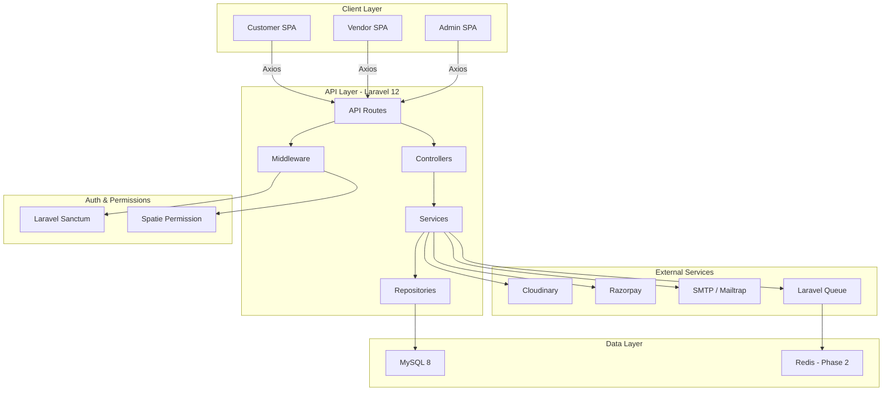

# System Architecture
## Multi-Vendor E-Commerce Platform
**Version:** 1.0.0
**Date:** 2026-07-14

---

## Table of Contents
1. [Architecture Overview](#1-architecture-overview)
2. [High-Level Architecture](#2-high-level-architecture)
3. [Frontend Architecture](#3-frontend-architecture)
4. [Backend Architecture](#4-backend-architecture)
5. [Database Architecture](#5-database-architecture)
6. [Authentication & Authorization Flow](#6-authentication--authorization-flow)
7. [Request Lifecycle](#7-request-lifecycle)
8. [Third-Party Integrations](#8-third-party-integrations)
9. [Folder Structure](#9-folder-structure)
10. [Deployment Architecture](#10-deployment-architecture)

---

## 1. Architecture Overview

The platform follows a **decoupled (headless) architecture** with:

- A **React SPA (Single Page Application)** as the frontend.
- A **Laravel REST API** as the backend.
- Communication happens entirely through **HTTP JSON API calls** using **Axios**.
- All API routes are secured via **Laravel Sanctum** tokens.
- Role-Based Access Control is enforced via **Spatie Laravel Permission**.

### Architecture Pattern
```
Client (Browser / Mobile)
         │
     [React 19 SPA]
         │  Axios HTTP Requests
         ▼
  [Laravel 12 REST API]
         │
  ┌──────┴──────────┐
  │  Sanctum (Auth) │
  │  Spatie (RBAC)  │
  └──────┬──────────┘
         │
  [Business Logic Layer]
  Services / Repositories
         │
  ┌──────┴──────────┐
  │   MySQL 8 DB    │
  │   (Eloquent ORM)│
  └──────┬──────────┘
         │
  [External Services]
  Cloudinary | Razorpay | SMTP | Redis (Phase 2)
```

---

## 2. High-Level Architecture



---

## 3. Frontend Architecture

### 3.1 Technology Breakdown

| Library | Role |
| :--- | :--- |
| React 19 | Component-based UI |
| Vite | Build tool and dev server |
| React Router DOM | Client-side navigation |
| Context API | Global state (Auth, Cart) |
| Axios | REST API communication |
| Bootstrap 5.3 | UI layout and components |
| React Hook Form | Form state and validation |
| React Toastify | Success/error notifications |
| Lucide React | Icon system |
| Recharts | Admin/Vendor chart dashboards |

### 3.2 Frontend Folder Structure

```
frontend/
└── src/
    ├── assets/             # Images, fonts, static files
    ├── components/         # Reusable UI components
    │   ├── common/         # Button, Input, Modal, Spinner
    │   ├── layout/         # Header, Footer, Sidebar
    │   └── cards/          # ProductCard, OrderCard
    ├── context/            # AuthContext, CartContext
    ├── hooks/              # useAuth, useCart, useFetch
    ├── layouts/            # AdminLayout, VendorLayout, CustomerLayout
    ├── pages/
    │   ├── auth/           # Login, Register, ForgotPassword
    │   ├── admin/          # Admin panel pages
    │   ├── vendor/         # Vendor panel pages
    │   └── customer/       # Customer-facing pages
    ├── routes/             # ProtectedRoute, RoleRoute, AppRouter
    ├── services/           # api.js, authService, productService
    ├── utils/              # helpers, formatters, constants
    ├── App.jsx
    └── main.jsx
```

### 3.3 State Management Strategy

| State | Method |
| :--- | :--- |
| Auth (user, token, role) | Context API (AuthContext) |
| Cart items | Context API (CartContext) |
| Server data (products, orders) | Local component state + Axios |
| Form state | React Hook Form |
| UI notifications | React Toastify |

### 3.4 Routing Strategy

```
/                         → Home (public)
/products                 → Product listing (public)
/products/:slug           → Product detail (public)
/login                    → Login page
/register                 → Register page

/customer/dashboard       → Customer dashboard (auth: customer)
/customer/orders          → Order history
/customer/wishlist        → Wishlist
/customer/cart            → Cart
/customer/checkout        → Checkout
/customer/profile         → Profile settings

/vendor/dashboard         → Vendor dashboard (auth: vendor)
/vendor/products          → Product management
/vendor/orders            → Order management
/vendor/earnings          → Earnings overview
/vendor/store             → Store settings

/admin/dashboard          → Admin dashboard (auth: admin)
/admin/vendors            → Vendor management
/admin/customers          → Customer management
/admin/categories         → Category management
/admin/products           → Product approval
/admin/orders             → All orders
/admin/coupons            → Coupon management
/admin/reports            → Sales reports
```

---

## 4. Backend Architecture

### 4.1 Design Pattern: Service-Repository

```
HTTP Request
    ↓
Route (routes/api.php)
    ↓
Middleware (Sanctum, Role, Throttle)
    ↓
Controller (thin — receives input, returns response)
    ↓
Service (business logic — validation, calculations)
    ↓
Repository (database queries — Eloquent)
    ↓
Model (Eloquent ORM → MySQL)
```

### 4.2 Backend Folder Structure

```
backend/
└── app/
    ├── Http/
    │   ├── Controllers/
    │   │   ├── Auth/
    │   │   ├── Admin/
    │   │   ├── Vendor/
    │   │   └── Customer/
    │   ├── Middleware/
    │   │   ├── RoleMiddleware.php
    │   │   └── VendorApprovedMiddleware.php
    │   └── Requests/           # Form Request Validation
    │       ├── Auth/
    │       ├── Product/
    │       └── Order/
    ├── Models/                 # Eloquent Models
    │   ├── User.php
    │   ├── Vendor.php
    │   ├── Product.php
    │   ├── Category.php
    │   ├── Order.php
    │   ├── OrderItem.php
    │   ├── Payment.php
    │   ├── Cart.php
    │   ├── Wishlist.php
    │   ├── Review.php
    │   ├── Coupon.php
    │   └── VendorEarning.php
    ├── Services/               # Business logic
    │   ├── AuthService.php
    │   ├── ProductService.php
    │   ├── OrderService.php
    │   ├── PaymentService.php
    │   ├── CartService.php
    │   └── EarningService.php
    ├── Repositories/           # DB queries
    │   ├── ProductRepository.php
    │   ├── OrderRepository.php
    │   └── UserRepository.php
    ├── Traits/                 # Reusable methods
    │   ├── ApiResponseTrait.php
    │   └── UploadTrait.php
    └── Jobs/                   # Queue Jobs
        ├── SendOrderConfirmationEmail.php
        └── ProcessVendorPayout.php
```

### 4.3 API Response Format

All API responses follow a consistent JSON structure:

**Success:**
```json
{
    "success": true,
    "message": "Product created successfully.",
    "data": { ... },
    "status": 201
}
```

**Error:**
```json
{
    "success": false,
    "message": "Validation failed.",
    "errors": { "email": ["The email field is required."] },
    "status": 422
}
```

---

## 5. Database Architecture

All tables use `BIGINT UNSIGNED` primary keys with `timestamps` (`created_at`, `updated_at`). Foreign key constraints are enforced at the database level.

### Core Tables
| Table | Description |
| :--- | :--- |
| `users` | All users (admin, vendor, customer) |
| `vendors` | Vendor store profiles |
| `categories` | Categories (self-referencing for subcategories) |
| `products` | Product listings |
| `product_images` | Multiple images per product |
| `product_variants` | Size, color variants |
| `carts` | Customer cart items |
| `wishlists` | Customer wishlist |
| `orders` | Customer orders |
| `order_items` | Line items per order (per vendor) |
| `payments` | Payment gateway transactions |
| `reviews` | Product ratings and comments |
| `coupons` | Discount codes |
| `vendor_earnings` | Per-item commission tracking |
| `addresses` | Customer saved addresses |

> Full ERD with all columns → see `03-Database-ERD.md`

---

## 6. Authentication & Authorization Flow

### 6.1 Registration Flow
```
POST /api/register
        ↓
Create User (role: customer / vendor)
        ↓
Send Email Verification
        ↓
Return: 201 { message: "Verify your email" }
```

### 6.2 Login Flow
```
POST /api/login
        ↓
Validate credentials
        ↓
Check email verified
        ↓
Issue Sanctum Token
        ↓
Return: { token, user, role }
```

### 6.3 Role-Based Route Protection
```
Request → Bearer Token in Authorization Header
        ↓
Sanctum Middleware: Validate token
        ↓
Spatie Middleware: Check role (admin / vendor / customer)
        ↓
Allow or Deny (403 Forbidden)
```

---

## 7. Request Lifecycle

```
Browser → React → Axios
           ↓
    Authorization: Bearer <token>
    Content-Type: application/json
           ↓
    Laravel API Route
           ↓
    auth:sanctum middleware
           ↓
    role middleware (admin/vendor/customer)
           ↓
    Form Request (validation)
           ↓
    Controller → Service → Repository → Model
           ↓
    JSON Response
           ↓
    React renders UI
```

---

## 8. Third-Party Integrations

### 8.1 Cloudinary (Image Storage)
- All product and store images are uploaded to Cloudinary.
- The `public_id` and `secure_url` are stored in the database.
- Images are uploaded from the backend using the Cloudinary PHP SDK.

### 8.2 Razorpay (Payment Gateway)
- Customer initiates payment from React frontend.
- Backend creates a Razorpay Order ID via API.
- Frontend opens Razorpay checkout modal.
- On success, frontend sends `payment_id` and `signature` to backend.
- Backend verifies signature and updates payment status.
- Webhook endpoint also listens for payment events.

### 8.3 Laravel Queues (Background Jobs)
- Order confirmation emails are dispatched to the queue.
- Vendor payout processing runs as a queued job.
- Queue driver: `database` in Phase 1, `Redis` in Phase 2.

### 8.4 Laravel Scheduler
- Daily: Generate and email sales reports to Admin.
- Weekly: Process vendor payouts.
- Ongoing: Mark expired coupons as inactive.

### 8.5 Email (Mailtrap / SMTP)
- Mailtrap used in development for email previewing.
- SMTP configured in production.
- Emails sent for: registration, password reset, order confirmation, vendor approval.

---

## 9. Folder Structure (Project Root)

```
multi-vendor-ecommerce/
│
├── frontend/               # React 19 + Vite application
├── backend/                # Laravel 12 application
├── docs/                   # All project documentation
│   ├── 01-Requirements.md
│   ├── 02-System-Architecture.md
│   ├── 03-Database-ERD.md
│   └── 04-API-Documentation.md
└── README.md
```

---

## 10. Deployment Architecture

### Phase 1 (Production)
```
GitHub Repository
        ↓
DigitalOcean / Hostinger VPS
        ↓
Nginx Web Server
  ├── React Build → /var/www/frontend/dist (served as static)
  └── Laravel     → /var/www/backend/public
        ↓
MySQL 8 (same VPS or managed DB)
        ↓
Cloudinary CDN (images)
```

### Phase 2 (Advanced)
```
GitHub Actions (CI/CD Pipeline)
        ↓
Docker Containers
  ├── php-fpm (Laravel)
  ├── nginx
  ├── mysql
  └── redis
        ↓
DigitalOcean Droplet / Kubernetes
```
