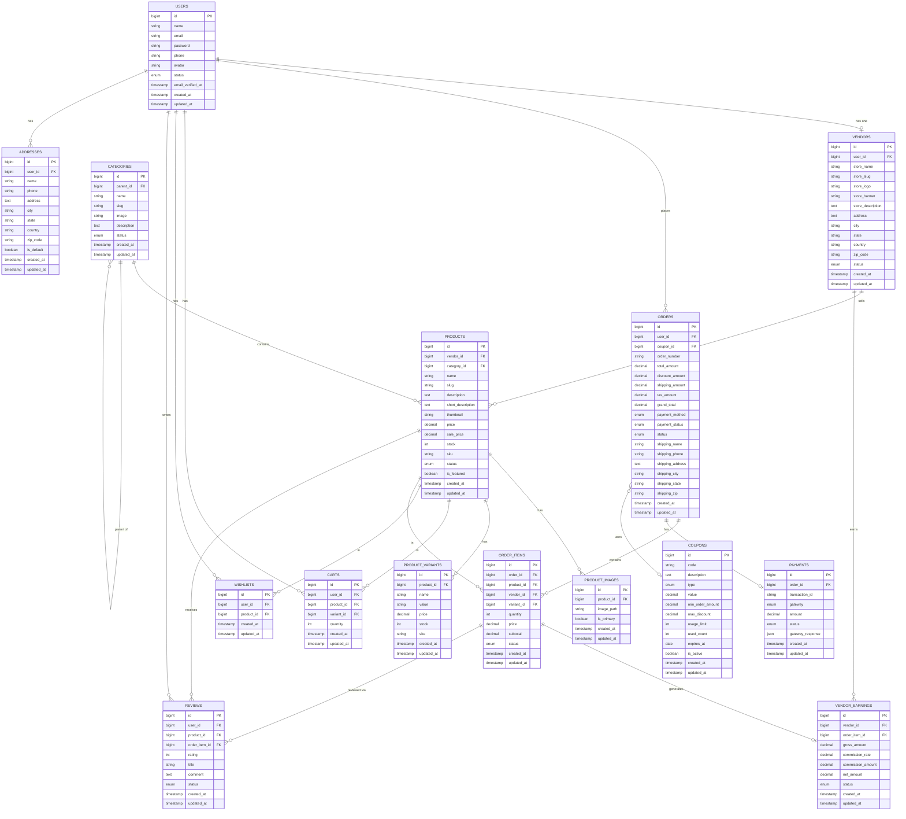

# Database Entity Relationship Diagram (ERD)
## Multi-Vendor E-Commerce Platform
**Version:** 1.0.0
**Date:** 2026-07-14

---

## Table of Contents
1. [ER Diagram](#1-er-diagram)
2. [Table Definitions](#2-table-definitions)
3. [Relationships Summary](#3-relationships-summary)
4. [Indexes](#4-indexes)

---

## 1. ER Diagram

---

## 2. Table Definitions

### Table: `users`
| Column | Type | Nullable | Default | Notes |
| :--- | :--- | :---: | :--- | :--- |
| id | BIGINT UNSIGNED | ❌ | AUTO | Primary Key |
| name | VARCHAR(255) | ❌ | — | Full name |
| email | VARCHAR(255) | ❌ | — | Unique |
| password | VARCHAR(255) | ❌ | — | Bcrypt hashed |
| phone | VARCHAR(20) | ✅ | NULL | — |
| avatar | VARCHAR(255) | ✅ | NULL | Cloudinary URL |
| status | ENUM | ❌ | active | `active`, `inactive`, `banned` |
| email_verified_at | TIMESTAMP | ✅ | NULL | — |
| created_at | TIMESTAMP | ✅ | NULL | Auto |
| updated_at | TIMESTAMP | ✅ | NULL | Auto |

---

### Table: `vendors`
| Column | Type | Nullable | Default | Notes |
| :--- | :--- | :---: | :--- | :--- |
| id | BIGINT UNSIGNED | ❌ | AUTO | Primary Key |
| user_id | BIGINT UNSIGNED | ❌ | — | FK → users.id |
| store_name | VARCHAR(255) | ❌ | — | — |
| store_slug | VARCHAR(255) | ❌ | — | Unique |
| store_logo | VARCHAR(255) | ✅ | NULL | Cloudinary URL |
| store_banner | VARCHAR(255) | ✅ | NULL | Cloudinary URL |
| store_description | TEXT | ✅ | NULL | — |
| address | TEXT | ✅ | NULL | — |
| city | VARCHAR(100) | ✅ | NULL | — |
| state | VARCHAR(100) | ✅ | NULL | — |
| country | VARCHAR(100) | ✅ | NULL | — |
| zip_code | VARCHAR(20) | ✅ | NULL | — |
| status | ENUM | ❌ | pending | `pending`, `approved`, `rejected`, `blocked` |
| created_at | TIMESTAMP | ✅ | NULL | Auto |
| updated_at | TIMESTAMP | ✅ | NULL | Auto |

---

### Table: `categories`
| Column | Type | Nullable | Default | Notes |
| :--- | :--- | :---: | :--- | :--- |
| id | BIGINT UNSIGNED | ❌ | AUTO | Primary Key |
| parent_id | BIGINT UNSIGNED | ✅ | NULL | FK → categories.id (self-ref) |
| name | VARCHAR(255) | ❌ | — | — |
| slug | VARCHAR(255) | ❌ | — | Unique |
| image | VARCHAR(255) | ✅ | NULL | Cloudinary URL |
| description | TEXT | ✅ | NULL | — |
| status | ENUM | ❌ | active | `active`, `inactive` |
| created_at | TIMESTAMP | ✅ | NULL | Auto |
| updated_at | TIMESTAMP | ✅ | NULL | Auto |

---

### Table: `products`
| Column | Type | Nullable | Default | Notes |
| :--- | :--- | :---: | :--- | :--- |
| id | BIGINT UNSIGNED | ❌ | AUTO | Primary Key |
| vendor_id | BIGINT UNSIGNED | ❌ | — | FK → vendors.id |
| category_id | BIGINT UNSIGNED | ❌ | — | FK → categories.id |
| name | VARCHAR(255) | ❌ | — | — |
| slug | VARCHAR(255) | ❌ | — | Unique |
| description | TEXT | ❌ | — | — |
| short_description | TEXT | ✅ | NULL | — |
| thumbnail | VARCHAR(255) | ❌ | — | Main image Cloudinary URL |
| price | DECIMAL(10,2) | ❌ | — | Original price |
| sale_price | DECIMAL(10,2) | ✅ | NULL | Discounted price |
| stock | INT | ❌ | 0 | Total quantity |
| sku | VARCHAR(100) | ❌ | — | Unique |
| status | ENUM | ❌ | pending | `active`, `inactive`, `pending` |
| is_featured | BOOLEAN | ❌ | false | Homepage feature flag |
| created_at | TIMESTAMP | ✅ | NULL | Auto |
| updated_at | TIMESTAMP | ✅ | NULL | Auto |

---

### Table: `product_images`
| Column | Type | Nullable | Default | Notes |
| :--- | :--- | :---: | :--- | :--- |
| id | BIGINT UNSIGNED | ❌ | AUTO | Primary Key |
| product_id | BIGINT UNSIGNED | ❌ | — | FK → products.id |
| image_path | VARCHAR(255) | ❌ | — | Cloudinary URL |
| is_primary | BOOLEAN | ❌ | false | — |
| created_at | TIMESTAMP | ✅ | NULL | Auto |
| updated_at | TIMESTAMP | ✅ | NULL | Auto |

---

### Table: `product_variants`
| Column | Type | Nullable | Default | Notes |
| :--- | :--- | :---: | :--- | :--- |
| id | BIGINT UNSIGNED | ❌ | AUTO | Primary Key |
| product_id | BIGINT UNSIGNED | ❌ | — | FK → products.id |
| name | VARCHAR(100) | ❌ | — | e.g., Size, Color |
| value | VARCHAR(100) | ❌ | — | e.g., XL, Red |
| price | DECIMAL(10,2) | ✅ | NULL | Override price |
| stock | INT | ❌ | 0 | — |
| sku | VARCHAR(100) | ✅ | NULL | — |
| created_at | TIMESTAMP | ✅ | NULL | Auto |
| updated_at | TIMESTAMP | ✅ | NULL | Auto |

---

### Table: `carts`
| Column | Type | Nullable | Default | Notes |
| :--- | :--- | :---: | :--- | :--- |
| id | BIGINT UNSIGNED | ❌ | AUTO | Primary Key |
| user_id | BIGINT UNSIGNED | ❌ | — | FK → users.id |
| product_id | BIGINT UNSIGNED | ❌ | — | FK → products.id |
| variant_id | BIGINT UNSIGNED | ✅ | NULL | FK → product_variants.id |
| quantity | INT | ❌ | 1 | — |
| created_at | TIMESTAMP | ✅ | NULL | Auto |
| updated_at | TIMESTAMP | ✅ | NULL | Auto |

---

### Table: `wishlists`
| Column | Type | Nullable | Default | Notes |
| :--- | :--- | :---: | :--- | :--- |
| id | BIGINT UNSIGNED | ❌ | AUTO | Primary Key |
| user_id | BIGINT UNSIGNED | ❌ | — | FK → users.id |
| product_id | BIGINT UNSIGNED | ❌ | — | FK → products.id |
| created_at | TIMESTAMP | ✅ | NULL | Auto |
| updated_at | TIMESTAMP | ✅ | NULL | Auto |

---

### Table: `addresses`
| Column | Type | Nullable | Default | Notes |
| :--- | :--- | :---: | :--- | :--- |
| id | BIGINT UNSIGNED | ❌ | AUTO | Primary Key |
| user_id | BIGINT UNSIGNED | ❌ | — | FK → users.id |
| name | VARCHAR(255) | ❌ | — | Recipient name |
| phone | VARCHAR(20) | ❌ | — | — |
| address | TEXT | ❌ | — | Street address |
| city | VARCHAR(100) | ❌ | — | — |
| state | VARCHAR(100) | ❌ | — | — |
| country | VARCHAR(100) | ❌ | — | — |
| zip_code | VARCHAR(20) | ❌ | — | — |
| is_default | BOOLEAN | ❌ | false | — |
| created_at | TIMESTAMP | ✅ | NULL | Auto |
| updated_at | TIMESTAMP | ✅ | NULL | Auto |

---

### Table: `orders`
| Column | Type | Nullable | Default | Notes |
| :--- | :--- | :---: | :--- | :--- |
| id | BIGINT UNSIGNED | ❌ | AUTO | Primary Key |
| user_id | BIGINT UNSIGNED | ❌ | — | FK → users.id |
| coupon_id | BIGINT UNSIGNED | ✅ | NULL | FK → coupons.id |
| order_number | VARCHAR(50) | ❌ | — | Unique, e.g. ORD-20260714-0001 |
| total_amount | DECIMAL(10,2) | ❌ | — | Before discount |
| discount_amount | DECIMAL(10,2) | ❌ | 0.00 | — |
| shipping_amount | DECIMAL(10,2) | ❌ | 0.00 | — |
| tax_amount | DECIMAL(10,2) | ❌ | 0.00 | — |
| grand_total | DECIMAL(10,2) | ❌ | — | Final payable amount |
| payment_method | ENUM | ❌ | — | `razorpay`, `stripe`, `cod` |
| payment_status | ENUM | ❌ | pending | `pending`, `paid`, `failed`, `refunded` |
| status | ENUM | ❌ | pending | `pending`, `processing`, `shipped`, `delivered`, `cancelled` |
| shipping_name | VARCHAR(255) | ❌ | — | — |
| shipping_phone | VARCHAR(20) | ❌ | — | — |
| shipping_address | TEXT | ❌ | — | — |
| shipping_city | VARCHAR(100) | ❌ | — | — |
| shipping_state | VARCHAR(100) | ❌ | — | — |
| shipping_zip | VARCHAR(20) | ❌ | — | — |
| created_at | TIMESTAMP | ✅ | NULL | Auto |
| updated_at | TIMESTAMP | ✅ | NULL | Auto |

---

### Table: `order_items`
| Column | Type | Nullable | Default | Notes |
| :--- | :--- | :---: | :--- | :--- |
| id | BIGINT UNSIGNED | ❌ | AUTO | Primary Key |
| order_id | BIGINT UNSIGNED | ❌ | — | FK → orders.id |
| product_id | BIGINT UNSIGNED | ❌ | — | FK → products.id |
| vendor_id | BIGINT UNSIGNED | ❌ | — | FK → vendors.id |
| variant_id | BIGINT UNSIGNED | ✅ | NULL | FK → product_variants.id |
| quantity | INT | ❌ | — | — |
| price | DECIMAL(10,2) | ❌ | — | Price at time of purchase |
| subtotal | DECIMAL(10,2) | ❌ | — | quantity × price |
| status | ENUM | ❌ | pending | `pending`, `processing`, `shipped`, `delivered`, `returned` |
| created_at | TIMESTAMP | ✅ | NULL | Auto |
| updated_at | TIMESTAMP | ✅ | NULL | Auto |

---

### Table: `payments`
| Column | Type | Nullable | Default | Notes |
| :--- | :--- | :---: | :--- | :--- |
| id | BIGINT UNSIGNED | ❌ | AUTO | Primary Key |
| order_id | BIGINT UNSIGNED | ❌ | — | FK → orders.id |
| transaction_id | VARCHAR(255) | ✅ | NULL | Gateway transaction ID |
| gateway | ENUM | ❌ | — | `razorpay`, `stripe`, `cod` |
| amount | DECIMAL(10,2) | ❌ | — | — |
| status | ENUM | ❌ | pending | `pending`, `success`, `failed`, `refunded` |
| gateway_response | JSON | ✅ | NULL | Raw gateway payload |
| created_at | TIMESTAMP | ✅ | NULL | Auto |
| updated_at | TIMESTAMP | ✅ | NULL | Auto |

---

### Table: `reviews`
| Column | Type | Nullable | Default | Notes |
| :--- | :--- | :---: | :--- | :--- |
| id | BIGINT UNSIGNED | ❌ | AUTO | Primary Key |
| user_id | BIGINT UNSIGNED | ❌ | — | FK → users.id |
| product_id | BIGINT UNSIGNED | ❌ | — | FK → products.id |
| order_item_id | BIGINT UNSIGNED | ❌ | — | FK → order_items.id |
| rating | TINYINT | ❌ | — | 1 to 5 |
| title | VARCHAR(255) | ✅ | NULL | — |
| comment | TEXT | ❌ | — | — |
| status | ENUM | ❌ | pending | `pending`, `approved`, `rejected` |
| created_at | TIMESTAMP | ✅ | NULL | Auto |
| updated_at | TIMESTAMP | ✅ | NULL | Auto |

---

### Table: `coupons`
| Column | Type | Nullable | Default | Notes |
| :--- | :--- | :---: | :--- | :--- |
| id | BIGINT UNSIGNED | ❌ | AUTO | Primary Key |
| code | VARCHAR(50) | ❌ | — | Unique, uppercase |
| description | TEXT | ✅ | NULL | — |
| type | ENUM | ❌ | — | `percentage`, `fixed` |
| value | DECIMAL(10,2) | ❌ | — | Discount value |
| min_order_amount | DECIMAL(10,2) | ✅ | NULL | Minimum cart total |
| max_discount | DECIMAL(10,2) | ✅ | NULL | Cap for percentage type |
| usage_limit | INT | ✅ | NULL | Max total uses |
| used_count | INT | ❌ | 0 | Times used |
| expires_at | DATE | ✅ | NULL | — |
| is_active | BOOLEAN | ❌ | true | — |
| created_at | TIMESTAMP | ✅ | NULL | Auto |
| updated_at | TIMESTAMP | ✅ | NULL | Auto |

---

### Table: `vendor_earnings`
| Column | Type | Nullable | Default | Notes |
| :--- | :--- | :---: | :--- | :--- |
| id | BIGINT UNSIGNED | ❌ | AUTO | Primary Key |
| vendor_id | BIGINT UNSIGNED | ❌ | — | FK → vendors.id |
| order_item_id | BIGINT UNSIGNED | ❌ | — | FK → order_items.id |
| gross_amount | DECIMAL(10,2) | ❌ | — | Total sale amount |
| commission_rate | DECIMAL(5,2) | ❌ | — | Platform % (e.g. 10.00) |
| commission_amount | DECIMAL(10,2) | ❌ | — | Platform's cut |
| net_amount | DECIMAL(10,2) | ❌ | — | Vendor's payout |
| status | ENUM | ❌ | pending | `pending`, `paid` |
| created_at | TIMESTAMP | ✅ | NULL | Auto |
| updated_at | TIMESTAMP | ✅ | NULL | Auto |

---

## 3. Relationships Summary

| From | To | Type | FK Column |
| :--- | :--- | :--- | :--- |
| users | vendors | One-to-One | vendors.user_id |
| users | orders | One-to-Many | orders.user_id |
| users | carts | One-to-Many | carts.user_id |
| users | wishlists | One-to-Many | wishlists.user_id |
| users | reviews | One-to-Many | reviews.user_id |
| users | addresses | One-to-Many | addresses.user_id |
| vendors | products | One-to-Many | products.vendor_id |
| vendors | vendor_earnings | One-to-Many | vendor_earnings.vendor_id |
| categories | categories | Self-referencing | categories.parent_id |
| categories | products | One-to-Many | products.category_id |
| products | product_images | One-to-Many | product_images.product_id |
| products | product_variants | One-to-Many | product_variants.product_id |
| products | order_items | One-to-Many | order_items.product_id |
| products | reviews | One-to-Many | reviews.product_id |
| orders | order_items | One-to-Many | order_items.order_id |
| orders | payments | One-to-One | payments.order_id |
| orders | coupons | Many-to-One | orders.coupon_id |
| order_items | vendor_earnings | One-to-One | vendor_earnings.order_item_id |
| order_items | reviews | One-to-Many | reviews.order_item_id |

---

## 4. Indexes

| Table | Column(s) | Index Type | Reason |
| :--- | :--- | :--- | :--- |
| users | email | UNIQUE | Login lookup |
| vendors | user_id | INDEX | User → Vendor join |
| vendors | store_slug | UNIQUE | Store URL |
| products | vendor_id | INDEX | Vendor product listing |
| products | category_id | INDEX | Category filter |
| products | slug | UNIQUE | Product URL |
| products | sku | UNIQUE | Inventory tracking |
| orders | user_id | INDEX | Customer orders |
| orders | order_number | UNIQUE | Order lookup |
| order_items | order_id | INDEX | Order breakdown |
| order_items | vendor_id | INDEX | Vendor order list |
| payments | order_id | UNIQUE | Payment lookup |
| reviews | product_id | INDEX | Product reviews |
| coupons | code | UNIQUE | Coupon validation |
| carts | user_id | INDEX | Cart lookup |
| wishlists | user_id, product_id | COMPOSITE | Duplicate prevention |
