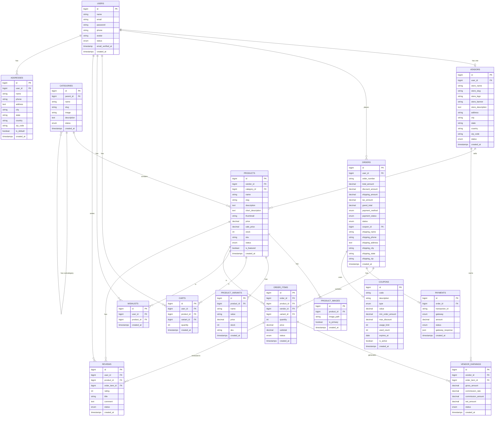

# Database Design – ER Diagram
## Multi-Vendor E-Commerce Platform

This document defines all database tables, their columns, data types, and relationships.

---

## ER Diagram (Entity Relationship)

---

## Table Definitions

### 1. `users`
| Column | Type | Notes |
| :--- | :--- | :--- |
| id | BIGINT UNSIGNED | Primary Key, Auto Increment |
| name | VARCHAR(255) | Full Name |
| email | VARCHAR(255) | Unique |
| password | VARCHAR(255) | Hashed |
| phone | VARCHAR(20) | Nullable |
| avatar | VARCHAR(255) | Nullable |
| status | ENUM | `active`, `inactive`, `banned` |
| email_verified_at | TIMESTAMP | Nullable |
| created_at / updated_at | TIMESTAMP | Auto |

---

### 2. `vendors`
| Column | Type | Notes |
| :--- | :--- | :--- |
| id | BIGINT UNSIGNED | Primary Key |
| user_id | BIGINT UNSIGNED | FK → users.id |
| store_name | VARCHAR(255) | — |
| store_slug | VARCHAR(255) | Unique |
| store_logo | VARCHAR(255) | Nullable |
| store_banner | VARCHAR(255) | Nullable |
| store_description | TEXT | Nullable |
| address | TEXT | Nullable |
| city / state / country | VARCHAR | Nullable |
| zip_code | VARCHAR(20) | Nullable |
| status | ENUM | `pending`, `approved`, `rejected`, `blocked` |
| created_at / updated_at | TIMESTAMP | Auto |

---

### 3. `categories`
| Column | Type | Notes |
| :--- | :--- | :--- |
| id | BIGINT UNSIGNED | Primary Key |
| parent_id | BIGINT UNSIGNED | FK → categories.id (self-ref) |
| name | VARCHAR(255) | — |
| slug | VARCHAR(255) | Unique |
| image | VARCHAR(255) | Nullable |
| description | TEXT | Nullable |
| status | ENUM | `active`, `inactive` |
| created_at / updated_at | TIMESTAMP | Auto |

---

### 4. `products`
| Column | Type | Notes |
| :--- | :--- | :--- |
| id | BIGINT UNSIGNED | Primary Key |
| vendor_id | BIGINT UNSIGNED | FK → vendors.id |
| category_id | BIGINT UNSIGNED | FK → categories.id |
| name | VARCHAR(255) | — |
| slug | VARCHAR(255) | Unique |
| description | TEXT | — |
| short_description | TEXT | Nullable |
| thumbnail | VARCHAR(255) | — |
| price | DECIMAL(10,2) | Original price |
| sale_price | DECIMAL(10,2) | Nullable, discounted price |
| stock | INT | Default 0 |
| sku | VARCHAR(100) | Unique |
| status | ENUM | `active`, `inactive`, `pending` |
| is_featured | BOOLEAN | Default false |
| created_at / updated_at | TIMESTAMP | Auto |

---

### 5. `product_images`
| Column | Type | Notes |
| :--- | :--- | :--- |
| id | BIGINT UNSIGNED | Primary Key |
| product_id | BIGINT UNSIGNED | FK → products.id |
| image_path | VARCHAR(255) | — |
| is_primary | BOOLEAN | Default false |
| created_at / updated_at | TIMESTAMP | Auto |

---

### 6. `product_variants`
| Column | Type | Notes |
| :--- | :--- | :--- |
| id | BIGINT UNSIGNED | Primary Key |
| product_id | BIGINT UNSIGNED | FK → products.id |
| name | VARCHAR(100) | e.g., Color, Size |
| value | VARCHAR(100) | e.g., Red, XL |
| price | DECIMAL(10,2) | Nullable |
| stock | INT | Default 0 |
| sku | VARCHAR(100) | Nullable |
| created_at / updated_at | TIMESTAMP | Auto |

---

### 7. `carts`
| Column | Type | Notes |
| :--- | :--- | :--- |
| id | BIGINT UNSIGNED | Primary Key |
| user_id | BIGINT UNSIGNED | FK → users.id |
| product_id | BIGINT UNSIGNED | FK → products.id |
| variant_id | BIGINT UNSIGNED | FK → product_variants.id, Nullable |
| quantity | INT | Default 1 |
| created_at / updated_at | TIMESTAMP | Auto |

---

### 8. `wishlists`
| Column | Type | Notes |
| :--- | :--- | :--- |
| id | BIGINT UNSIGNED | Primary Key |
| user_id | BIGINT UNSIGNED | FK → users.id |
| product_id | BIGINT UNSIGNED | FK → products.id |
| created_at / updated_at | TIMESTAMP | Auto |

---

### 9. `orders`
| Column | Type | Notes |
| :--- | :--- | :--- |
| id | BIGINT UNSIGNED | Primary Key |
| user_id | BIGINT UNSIGNED | FK → users.id |
| order_number | VARCHAR(50) | Unique |
| total_amount | DECIMAL(10,2) | Before discounts |
| discount_amount | DECIMAL(10,2) | Default 0 |
| shipping_amount | DECIMAL(10,2) | Default 0 |
| tax_amount | DECIMAL(10,2) | Default 0 |
| grand_total | DECIMAL(10,2) | Final payable |
| payment_method | ENUM | `razorpay`, `stripe`, `cod` |
| payment_status | ENUM | `pending`, `paid`, `failed`, `refunded` |
| status | ENUM | `pending`, `processing`, `shipped`, `delivered`, `cancelled` |
| coupon_id | BIGINT UNSIGNED | FK → coupons.id, Nullable |
| shipping_name, phone, address, city, state, zip | VARCHAR/TEXT | Shipping details |
| created_at / updated_at | TIMESTAMP | Auto |

---

### 10. `order_items`
| Column | Type | Notes |
| :--- | :--- | :--- |
| id | BIGINT UNSIGNED | Primary Key |
| order_id | BIGINT UNSIGNED | FK → orders.id |
| product_id | BIGINT UNSIGNED | FK → products.id |
| vendor_id | BIGINT UNSIGNED | FK → vendors.id |
| variant_id | BIGINT UNSIGNED | FK → product_variants.id, Nullable |
| quantity | INT | — |
| price | DECIMAL(10,2) | Price at time of purchase |
| subtotal | DECIMAL(10,2) | quantity × price |
| status | ENUM | `pending`, `shipped`, `delivered`, `returned` |
| created_at / updated_at | TIMESTAMP | Auto |

---

### 11. `payments`
| Column | Type | Notes |
| :--- | :--- | :--- |
| id | BIGINT UNSIGNED | Primary Key |
| order_id | BIGINT UNSIGNED | FK → orders.id |
| transaction_id | VARCHAR(255) | From payment gateway |
| gateway | ENUM | `razorpay`, `stripe` |
| amount | DECIMAL(10,2) | — |
| status | ENUM | `pending`, `success`, `failed`, `refunded` |
| gateway_response | JSON | Full gateway response |
| created_at / updated_at | TIMESTAMP | Auto |

---

### 12. `reviews`
| Column | Type | Notes |
| :--- | :--- | :--- |
| id | BIGINT UNSIGNED | Primary Key |
| user_id | BIGINT UNSIGNED | FK → users.id |
| product_id | BIGINT UNSIGNED | FK → products.id |
| order_item_id | BIGINT UNSIGNED | FK → order_items.id |
| rating | TINYINT | 1 to 5 |
| title | VARCHAR(255) | Nullable |
| comment | TEXT | — |
| status | ENUM | `pending`, `approved`, `rejected` |
| created_at / updated_at | TIMESTAMP | Auto |

---

### 13. `coupons`
| Column | Type | Notes |
| :--- | :--- | :--- |
| id | BIGINT UNSIGNED | Primary Key |
| code | VARCHAR(50) | Unique |
| description | TEXT | Nullable |
| type | ENUM | `percentage`, `fixed` |
| value | DECIMAL(10,2) | Discount value |
| min_order_amount | DECIMAL(10,2) | Nullable |
| max_discount | DECIMAL(10,2) | Nullable |
| usage_limit | INT | Nullable |
| used_count | INT | Default 0 |
| expires_at | DATE | Nullable |
| is_active | BOOLEAN | Default true |
| created_at / updated_at | TIMESTAMP | Auto |

---

### 14. `vendor_earnings`
| Column | Type | Notes |
| :--- | :--- | :--- |
| id | BIGINT UNSIGNED | Primary Key |
| vendor_id | BIGINT UNSIGNED | FK → vendors.id |
| order_item_id | BIGINT UNSIGNED | FK → order_items.id |
| gross_amount | DECIMAL(10,2) | Revenue before commission |
| commission_rate | DECIMAL(5,2) | Platform % cut |
| commission_amount | DECIMAL(10,2) | Platform earnings |
| net_amount | DECIMAL(10,2) | Vendor's payout |
| status | ENUM | `pending`, `paid` |
| created_at / updated_at | TIMESTAMP | Auto |

---

### 15. `addresses`
| Column | Type | Notes |
| :--- | :--- | :--- |
| id | BIGINT UNSIGNED | Primary Key |
| user_id | BIGINT UNSIGNED | FK → users.id |
| name | VARCHAR(255) | Recipient name |
| phone | VARCHAR(20) | — |
| address | TEXT | — |
| city / state / country | VARCHAR | — |
| zip_code | VARCHAR(20) | — |
| is_default | BOOLEAN | Default false |
| created_at / updated_at | TIMESTAMP | Auto |

---

## Relationships Summary

| Relationship | Type |
| :--- | :--- |
| User → Vendor | One to One |
| User → Orders | One to Many |
| User → Cart | One to Many |
| User → Wishlist | One to Many |
| User → Reviews | One to Many |
| User → Addresses | One to Many |
| Vendor → Products | One to Many |
| Vendor → Earnings | One to Many |
| Category → Products | One to Many |
| Category → Category | Self-referencing (Parent/Child) |
| Product → Images | One to Many |
| Product → Variants | One to Many |
| Order → Order Items | One to Many |
| Order → Payment | One to One |
| Order → Coupon | Many to One |
| Order Item → Earnings | One to One |

---

## Next Step → Create Laravel Migrations
`04_Migrations.md`
